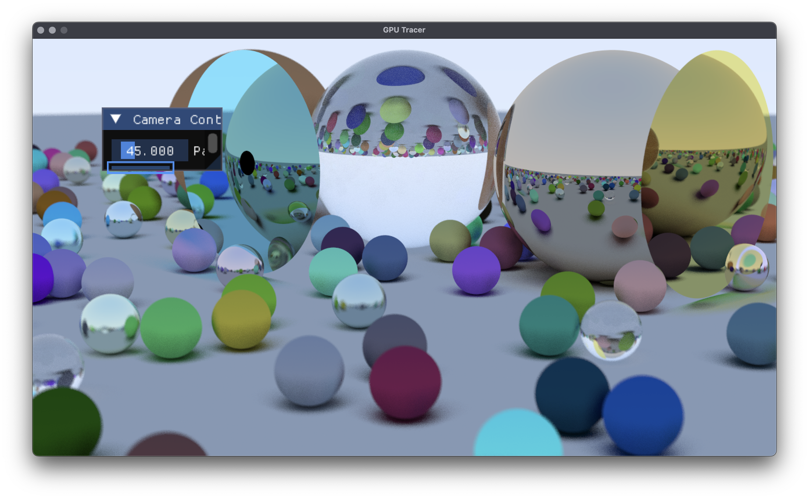

# CSED451 Term Project

Ray tracing with portals



## How to Build

1. Make sure that Vulkan SDK is installed.
2. Run CMake and create build files. CMake will download other dependencies such as `glm`, `glfw`, and `imgui`. If `ninja-build` is to be used, you can use something like

```shell
$ cmake -DCMAKE_BUILD_TYPE=Debug -G Ninja ..
```

3. Build the project and look at GPUs going brrrr
